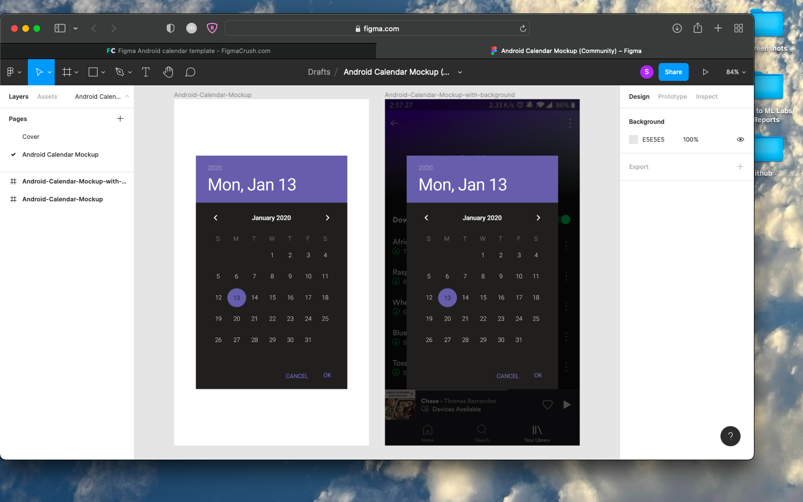
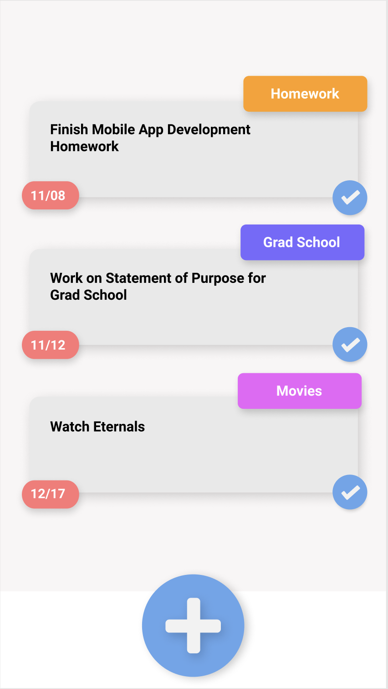

# ScheduleBuilder

===
## Overview
### Description
 A Schedule App that is able to track and created a schedule of your events based on its priority.
### App Evaluation
- **Category:** Social/Productivity
- **Mobile:** This app will mainly but to subjected to mobile platforms.
- **Story:** Analyzes and determines user's schedule based on the level of priority which is created by the user.
- **Market:** Mainly created for people who do not have time to create their own schedule. can also be used casually. 
- **Habit:** Created to be used frequently but not necessary to.
- **Scope:** To start we want to just create the basis of the schedule app builder. The design and extra implements wilkl be added on later. Hopefully this can transform into a new type of Productivity app that helps the user create their own schedule.

## Product Spec
### 1. User Stories (Required and Optional)

**Required Must-have Stories**

- [x] User is able to make event cards
- [x] User can check the day and week of the month
- [x] User is able to choose the priority of the cards
- [x]Cards can be ordered based on what the user chose as priority
- [x]User can see a simple to-do list
**Optional Nice-to-have Stories**

* User is able to customize their own calender and event cards
* There will be a leaderboard helping user will goals they plan to have
* Optional settings


### 2. Screen Archetypes

* Home Screem
* Calender
* Event Cards  - Cards that contains the priority of an event
   *Where users can customize and sort there events by using the app's card feature
* Daily, Weekly
   * Users can see their schedule by day or by week based on their choices
* Settings Screen
   * Allows Users to change and customize their calender

### 3. Navigation

**Tab Navigation** (Tab to Screen)

* Home
* Calender
* Event Card Creation
* To Do
* Settings


**Flow Navigation** (Screen to Screen)
* Home-> Jumps to Calender
* Calender -> Can go straight to daily or weekly screen
* ToDo -> Can be changed and added. Can also go straight to Calender when event is pressed
* Settings -> Toggle settings

## Wireframes
Schedule Builder Protoype layout: https://www.figma.com/file/04oPo59pUFCNJsO3yAPY4r/Schedule-Builder?node-id=0%3A1
Todo layout:



## Schema

**Models**
Events

| Property      | Type          | Description  |
| ------------- |:-------------:| ------------:|
| name      | String       | name of event                       |
| locked    | boolean      | if the timeframe can change or not  |
| isMorning | boolean      | if it is morning or not             |
| startTime | int          | start of the event                  | 
| endTime   | int          | end of the event                    |       
| priority  | int          | the events order of priority        |

User 

| Property      | Type          | Description  |
| ------------- |:-------------:| ------------:|
| militaryTime  | boolean      | if user wants military time or not |
| cardDisplay   | boolean      | activates card view                |
| timeTracker   | boolean      | activates notifications            |


**Networking**
#### List of network requests by screen
   - Home Calendar Screen
      - (Read/GET) Query all posts where user is author
         ```swift
         let query = PFQuery(className:"Event")
         query.whereKey("name", equalTo: currentUser)
         query.order(byDescending: "priority")
         query.findObjectsInBackground { (events: [PFObject]?, error: Error?) in
            if let error = error { 
               print(error.localizedDescription)
            } else if let events = events {
               print("Successfully retrieved \(events.count) event.")
           // TODO: Do something with posts...
            }
         }
         ```
   - Create Calendar Screen  
      - (Read/GET) schedule on given day
      - (Create/EVENT) priority cards
      - (Delete) existing priority cards
      - (Update/PUT) priority cards and schedule
   - Create Leaderboard
      - (Read/GET) Leaderboard 

   - Settings
      - (Read/GET) card information
      - (Update/PUT) update time and get miltitary time
      - (Read/GET) notifications for user


**Updates**
#### Gifs
## Update 1: 
https://github.com/Schedule-Builder/ScheduleBuilder/blob/master/Schedule_Builder_Update.gif

## Update 2:
https://github.com/Schedule-Builder/ScheduleBuilder/blob/master/Schedule_Builder_Update2.gif
Currently we are trying to get the title of the event card to show up on the day when you press the save button

## Update 3:
https://github.com/Schedule-Builder/ScheduleBuilder/blob/master/Schedule_Builder_Update3.gif

## Update 4:
Schedule Build is now able to sort and order events based on priority and time. It can also change from military and normal time.
     
